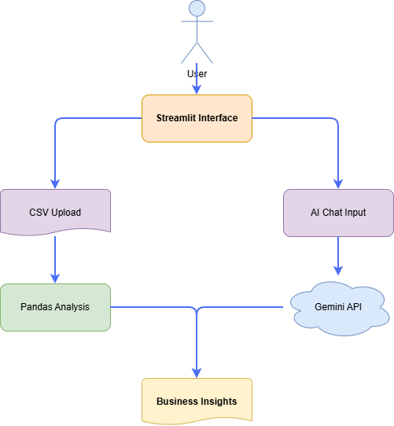
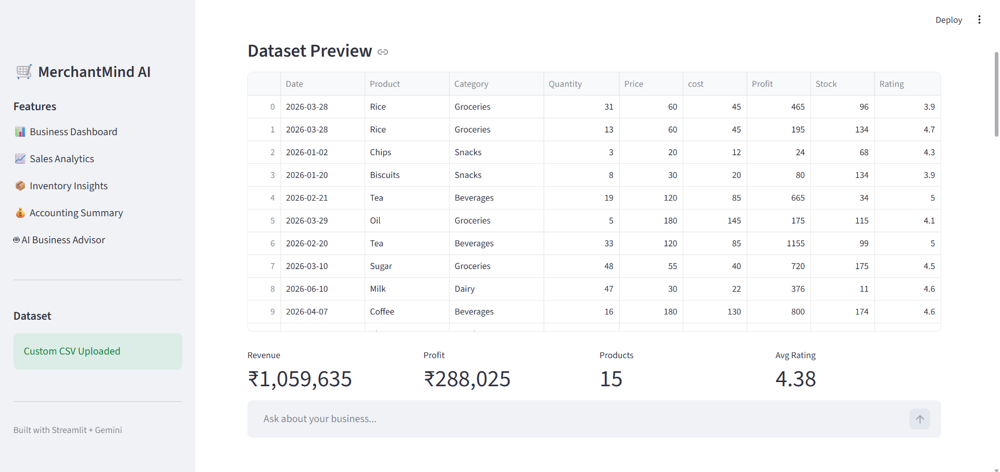
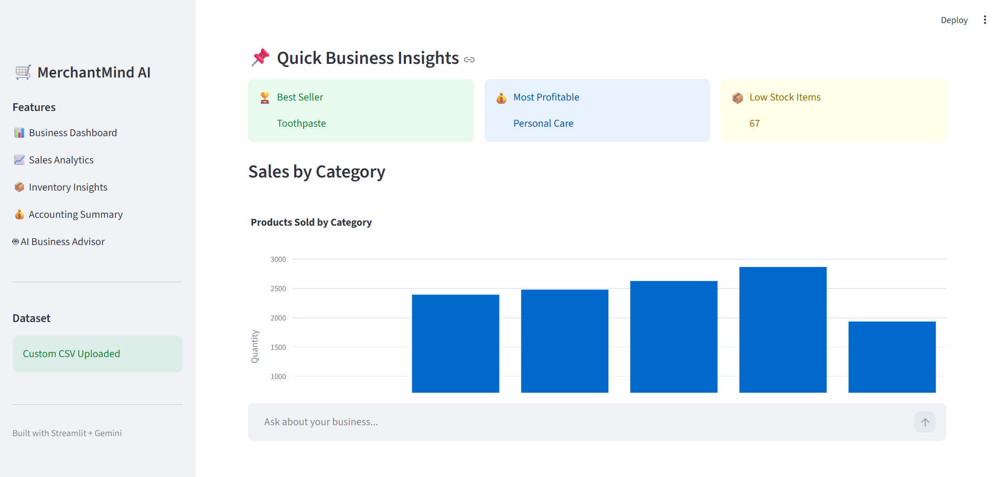
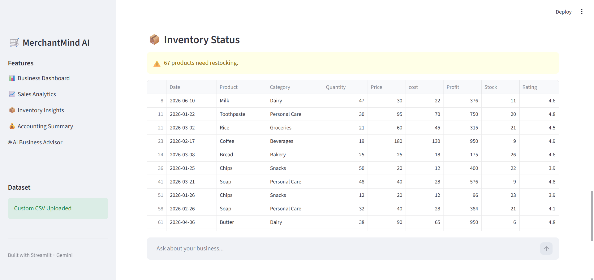
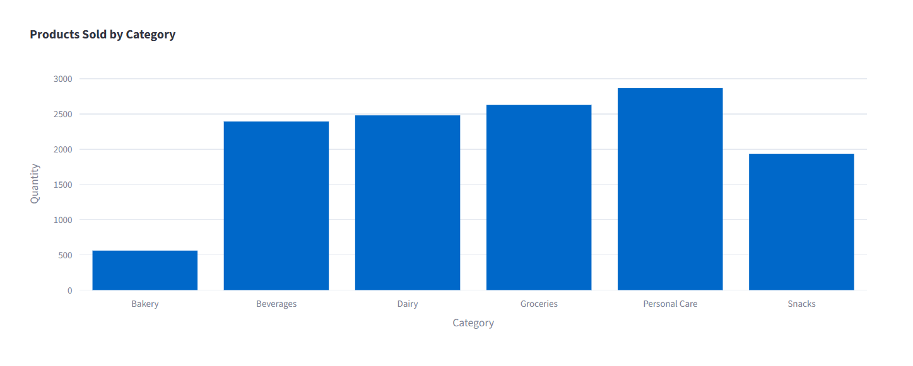
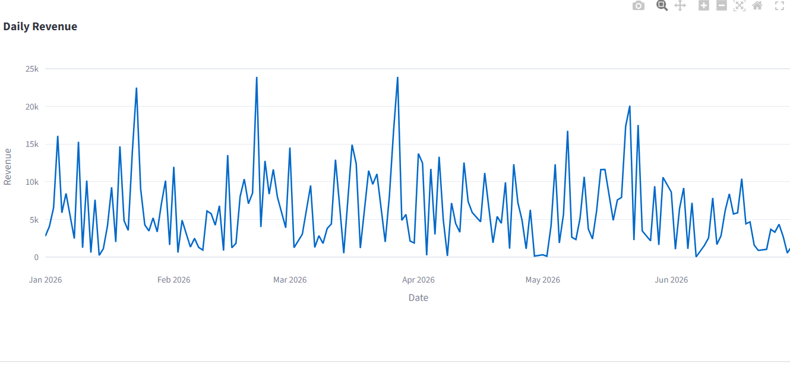

# 🛒 MerchantMind AI

### AI-Powered Business Intelligence Assistant for Local Merchants

MerchantMind AI is an intelligent business analytics platform that helps local merchants make data-driven decisions using Artificial Intelligence. By uploading a sales dataset, merchants can instantly visualize business performance, monitor inventory, identify top-selling products, and receive AI-generated business recommendations through a conversational assistant powered by Google's Gemini model.

---

## 📌 Problem Statement

Many small and local businesses collect sales data but lack the tools or expertise to transform that data into meaningful business insights. As a result, important decisions such as inventory planning, pricing strategies, and identifying high-performing products are often based on intuition rather than evidence.

MerchantMind AI addresses this challenge by providing an easy-to-use AI assistant that analyzes sales data and delivers actionable recommendations in real time.

---

## 🚀 Features

- 📂 Upload any supported sales CSV file
- 📊 Interactive business dashboard
- 💰 Revenue and profit analytics
- 📈 Sales trend visualization
- 🏆 Top-selling product identification
- 📦 Low-stock inventory detection
- 🤖 AI-powered business advisor using Gemini
- 💡 Automated business recommendations
- 💬 Conversational AI for natural language business queries
- 📥 Download processed business report

---

## 🧠 AI Workflow

The application follows a modular agent-based workflow:

```
                    User
                      │
                      ▼
              MerchantMind AI
                      │
        ┌─────────────┼─────────────┐
        ▼             ▼             ▼
 Sales Analysis   Inventory      Business
      Agent         Agent        AI Advisor
        │             │             │
        └─────────────┼─────────────┘
                      ▼
                Gemini AI Model
                      ▼
               Business Insights
```

---

## 📸 Architecture



---

## 📷 Screenshots

### Dashboard

*(Add screenshot here)*

### Sales Analytics

*(Add screenshot here)*

### Inventory Analysis

*(Add screenshot here)*

### AI Business Assistant

*(Add screenshot here)*

---

## ⚙️ Tech Stack

| Technology | Purpose |
|------------|---------|
| Python | Backend |
| Streamlit | Web Application |
| Pandas | Data Processing |
| Plotly | Interactive Charts |
| Google Gemini API | AI Business Assistant |
| python-dotenv | Secure API Key Management |

---

## 📁 Project Structure

```
merchantmind-ai/
│
├── agents/
│   ├── chat_agent.py
│   ├── sales_agent.py
│   ├── inventory_agent.py
│   └── router.py
│
├── config/
│   ├── settings.py
│   └── prompts.py
│
├── data/
│   └── sample_sales.csv
│
├── docs/
│   ├── architecture.png
│   └── screenshots/
│
├── app.py
├── requirements.txt
├── README.md
├── .env
└── .gitignore
```

---

## 📊 Dataset

MerchantMind AI accepts sales datasets containing fields similar to:

- Date
- Product
- Category
- Quantity
- Price
- Profit
- Stock
- Rating

A sample dataset is included inside the `data` folder.

---

## 🤖 AI Capabilities

The AI assistant can answer questions such as:

- Which products generate the highest revenue?
- Which items should be restocked?
- Which categories are most profitable?
- How can I improve overall business performance?
- Suggest marketing strategies.
- Recommend inventory improvements.
- Identify slow-moving products.

---

## 🔒 Security

- API keys are stored securely using environment variables.
- `.env` is excluded from version control.
- Uploaded datasets are validated before analysis.
- No sensitive credentials are exposed in the source code.

---

## 💻 Installation

Clone the repository:

```bash
git clone https://github.com/your-username/merchantmind-ai.git
```

Move into the project directory:

```bash
cd merchantmind-ai
```

Install dependencies:

```bash
pip install -r requirements.txt
```

Create a `.env` file:

```env
GEMINI_API_KEY=YOUR_API_KEY
```

Run the application:

```bash
streamlit run app.py
```

---

## 🎯 Business Impact

MerchantMind AI enables local merchants to:

- Understand sales performance
- Monitor inventory efficiently
- Improve profitability
- Make informed purchasing decisions
- Reduce manual business analysis
- Save time through AI-assisted decision-making

---

## 🚀 Future Improvements

- Multi-user authentication
- Sales forecasting using Machine Learning
- Customer segmentation
- OCR-based invoice processing
- Multi-store support
- Voice-enabled AI assistant
- Automated PDF report generation
- ERP integration

---

## 📷Screenshots

### Dataset preview


### Sales analytics


### Inventory View


### Products sold by category(Bar Chart)


### Revenue(Graph)

## 📹 Demo

**Video Demonstration:** *(Add your YouTube link here)*

---

## 👨‍💻 Author

**Sruti Swarupa Mahapatra**

Kaggle × Google AI Agents Capstone Project

---

## 📜 License

This project is developed for educational and portfolio purposes as part of the Kaggle × Google AI Agents: Intensive Vibe Coding Capstone Project.